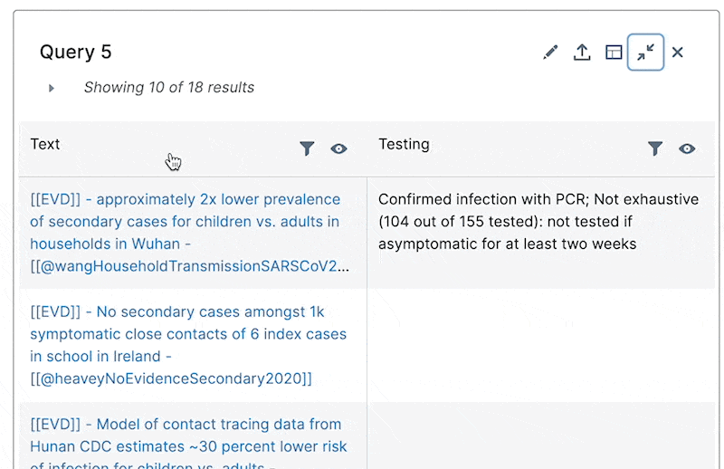

# Querying your discourse graph


**Note: a lot of the querying functionality overlaps with the RoamJS query-builder extension, which was spun off from this extension. You might find the documentation for the query-builder helpful for learning how to run queries:** [**https://roamjs.com/extensions/query-builder**](https://roamjs.com/extensions/query-builder)****


The query drawer component allows you to construct structured queries over your discourse graph, based on discourse relations (e.g., "find all evidence that supports/opposes a claim"), and reason over the results in a structured, tabular format (e.g., "find all evidence that supports a claim, and allow me to filter/sort by methodological details").&#x20;

## Quick demo


Demo of query drawer (\*slightly\* different version from latest version, so some details of the results table are different)


## Making a query

Use Command Palette (⌘+`P` on Mac,`CTRL`+ `P` otherwise) to access the query drawer.

A query drawer component will open from the left. From there, you can construct structured queries of your discourse graph and explore their results in a tabular format.

## Some common queries

### Find all evidence that informs a question

Example query:

The results:

### Find all evidence that supports a claim

Example query:

The results:

## More advanced queries

### Mix discourse and Roam queries

Example: find all evidence that informs a question, but only if it was collected in a specific location (this example assumes at least some evidence pages have an attribute `Location::` in them)

Results:

### Select node attributes to display as attributes of results

Example: find all evidence that informs a question, and select a methods attribute to display so we can sort/filter on it (this example assumes at least some evidence pages have an attribute `testingRegime::` in them)

Results (note: will display "blank" for nodes that lack values for the selected attribute):

### Select discourse attributes to display as attributes of results

If you have defined [discourse-attributes.md](exploring-your-discourse-graph/discourse-attributes.md "mention") for the node you want to query, you can select it as a column in your query. The syntax for accessing a node's discourse attribute as a select is`discourse:discourseAttributeName`.

Example: find all claims and display their "Evidence" discourse attributes (number of supporting evidence relations) as a column.&#x20;

Results:

## Sorting/filtering a query's results

You can filter and sort each column in the results table.



## Naming a query

You can name a query if you like!

## Saving a query to its own page

You can save a query to its own page if you want to keep it around for easier access.&#x20;

It will be saved to the namespace `discourse-graph/queries/`

