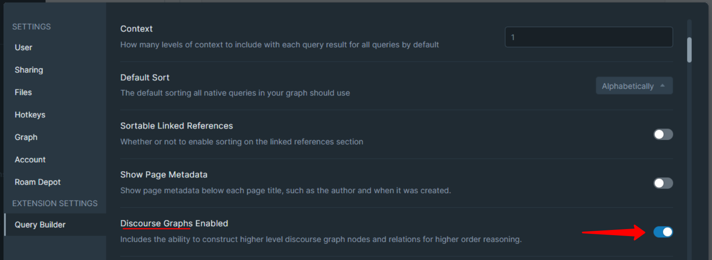

# 👷♀ Installation

Discourse Graphs is part of the Query Builder extension. &#x20;

### Install Query Builder

The Query Builder extension can be installed via Roam Depot:

<figure><figcaption></figcaption></figure>

<figure><figcaption></figcaption></figure>

<figure><figcaption></figcaption></figure>

### Toggle Discourse Graphs

After you have installed the Query Builder extension, scroll down to the `Discourse Graphs` toggle and switch it to `on`:

<figure><figcaption></figcaption></figure>

### Verify

You can verify that it was successful by navigating to `roam/js/discourse-graph` and you should see a configuration panel like this:

<figure><figcaption></figcaption></figure>

